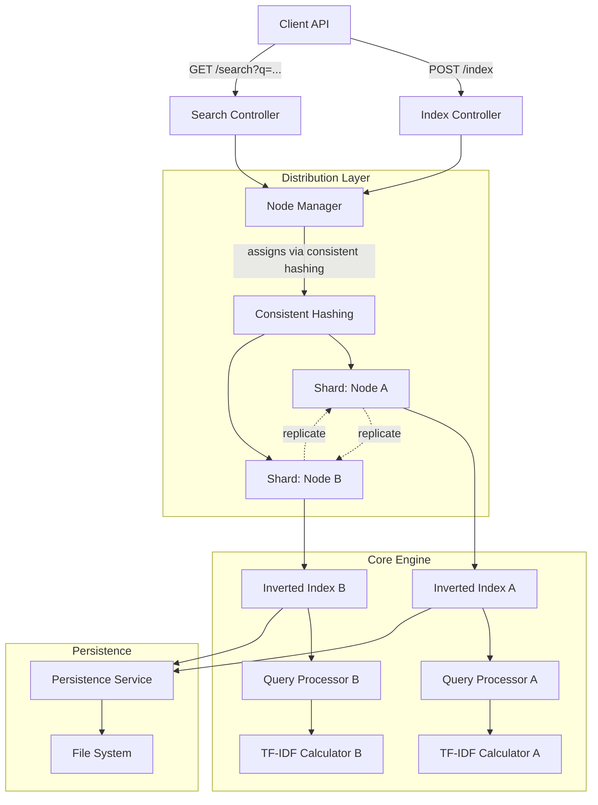

# Distributed Search Engine

A production-ready distributed search engine built with Spring Boot, featuring sharded indexing, concurrent search, and TF-IDF ranking.

## Features

- 🚀 **REST API**: Simple endpoints for indexing and searching documents
- 🔄 **Distributed Architecture**: Sharded data across multiple nodes using consistent hashing
- ⚡ **Concurrent Search**: Parallel query processing across shards with ExecutorService
- 💾 **Persistence**: File-based serialization for data durability
- 📊 **TF-IDF Scoring**: Relevance-based search result ranking
- 🧪 **Comprehensive Testing**: Unit tests and integration tests included
- 📈 **Load Testing**: JMeter configuration for performance validation

## Quick Start

### Prerequisites
- Java 17 or higher
- Maven 3.6+ (or use included wrapper)

### Running the Application

```bash
# Option 1: Use the provided script
./start.sh

# Option 2: Direct Maven command
mvn spring-boot:run

# Option 3: Maven wrapper (if available)
./mvnw spring-boot:run
```

The application will start on `http://localhost:8080`

### Testing the API

**Index a document:**
```bash
curl -X POST http://localhost:8080/api/index \
  -H "Content-Type: application/json" \
  -d '{"id": 1, "content": "Java programming tutorial"}'
```

**Search for documents:**
```bash
curl "http://localhost:8080/api/search?q=java"
```

## API Endpoints

### POST `/api/index`
Index a new document.

**Request Body:**
```json
{
  "id": 1,
  "content": "Document content to be indexed"
}
```

**Response:**
```
Document indexed successfully with ID: 1
```

### GET `/api/search?q={query}`
Search for documents containing the query terms.

**Parameters:**
- `q`: Search query string

**Response:**
```json
{
  "results": [
    {
      "id": 1,
      "content": "Document content",
      "score": 0.85
    }
  ],
  "totalResults": 1
}
```

## Architecture



## Core Components

### 1. **REST Controllers** (`/api` package)
- **IndexController**: Handles document indexing via POST `/api/index`
- **SearchController**: Handles search queries via GET `/api/search`

### 2. **Distribution Layer** (`/distributed` package)
- **NodeManager**: Orchestrates document distribution and parallel search
- **ConsistentHashing**: Distributes documents across shards
- **ExecutorService**: Enables concurrent search across shards

### 3. **Core Engine** (`/core` package)
- **InvertedIndex**: Term-to-document mapping with frequency counts
- **QueryProcessor**: Processes search queries and ranks results
- **TFIDFCalculator**: Computes relevance scores
- **Document**: Represents indexed documents

### 4. **Persistence Layer** (`/persistence` package)
- **PersistenceService**: Handles serialization to/from disk
- Automatic save/load on startup and shutdown

## Testing

### Run Unit Tests
```bash
./run-tests.sh
```

### Integration Testing
The included integration tests verify:
- Document indexing and retrieval
- Search functionality with TF-IDF ranking
- API response formats
- Error handling

### Load Testing
See `load-testing/README.md` for comprehensive performance testing instructions.

## Performance

### Current Configuration
- **Shards**: 2 (NodeA, NodeB)
- **Search Threads**: 8 (configurable)
- **Persistence**: File-based serialization

### Expected Performance
- **Throughput**: 500-1000 requests/second
- **Response Time**: <100ms (95th percentile)
- **Concurrency**: 50+ simultaneous users

### Scaling Recommendations
1. **Horizontal**: Add more shards by calling `nodeManager.addNode(nodeId)`
2. **Vertical**: Increase thread pool size in NodeManager constructor
3. **Memory**: Tune JVM heap size with `-Xmx` parameter
4. **Persistence**: Consider database backend for larger datasets

## Configuration

### Application Properties
Create `src/main/resources/application.properties`:
```properties
server.port=8080
logging.level.com.searchengine=INFO
```

### JVM Tuning
For production deployment:
```bash
java -Xmx2g -Xms1g -XX:+UseG1GC -jar distributed-search-engine.jar
```

## Development

### Project Structure
```
src/
├── main/java/com/searchengine/
│   ├── api/                 # REST controllers
│   ├── config/              # Spring configuration
│   ├── core/                # Search engine core
│   ├── distributed/         # Distribution logic
│   ├── persistence/         # Data persistence
│   └── util/                # Utilities
└── test/java/com/searchengine/
    ├── core/                # Unit tests
    └── api/                 # Integration tests
```

### Adding New Features

1. **New Search Algorithms**: Implement in `QueryProcessor`
2. **Additional Persistence**: Extend `PersistenceService`
3. **Monitoring**: Add metrics collection in controllers
4. **Security**: Implement authentication in Spring Security

### NodeManager Usage

The `NodeManager` class supports two constructors:

```java
// For Spring Boot (dependency injection)
@Autowired
NodeManager nodeManager; // Uses PersistenceService bean

// For testing/standalone usage
NodeManager manager = new NodeManager(); // Creates own PersistenceService

// Custom persistence configuration
PersistenceService customPersistence = new PersistenceService();
NodeManager manager = new NodeManager(customPersistence);
```

## Troubleshooting

### Common Issues

**Application won't start:**
- Check Java version: `java --version`
- Verify port 8080 is available: `lsof -i :8080`

**Out of memory errors:**
- Increase heap size: `-Xmx2g`
- Monitor GC with: `-XX:+PrintGC`

**Poor search performance:**
- Increase thread pool size in NodeManager
- Check system CPU usage
- Consider adding more shards

**Persistence errors:**
- Check file permissions in `search-engine-data/` directory
- Verify disk space availability

## Contributing

1. Fork the repository
2. Create a feature branch: `git checkout -b feature-name`
3. Run tests: `./run-tests.sh`
4. Submit a pull request

## License

This project is licensed under the MIT License.
